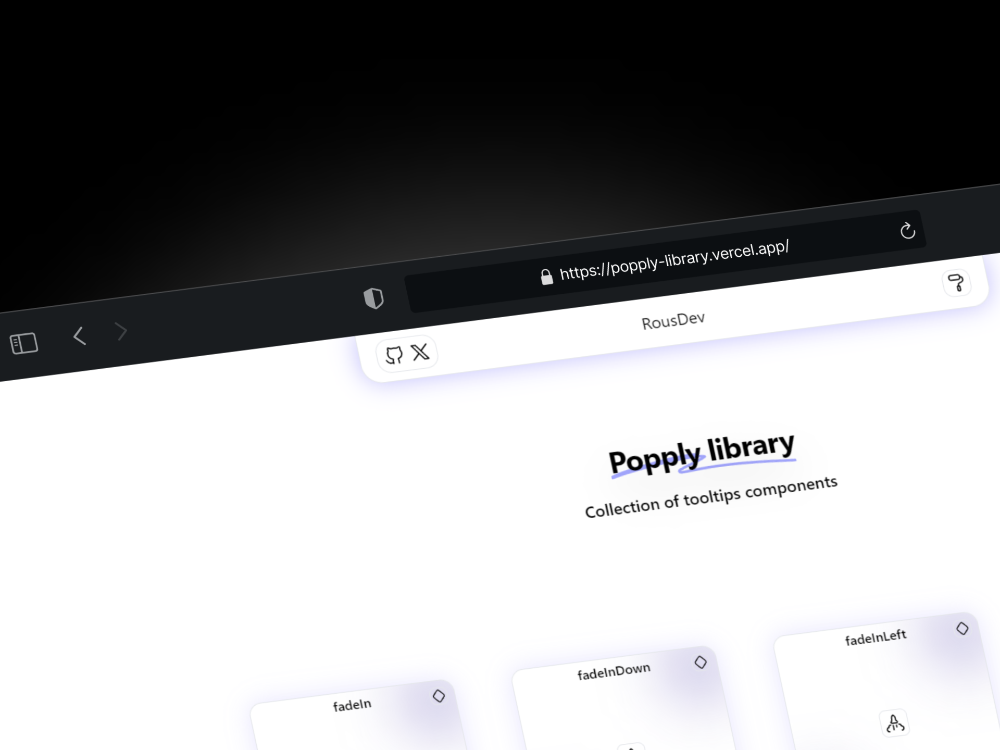

  <h3>
    Welcome to My Digital Home.
  </h3>

  <h3>
    Skills and Tools.
  </h3>

  

  

  

  

  

  <h3>
    About
    
  </h3>
  As a passionate software developer, I am dedicated to transforming ideas into immersive and aesthetically pleasing digital experiences. My focus is on creating exceptional user interfaces that are not only functional, but also visually stunning.

I am currently a Software Engineering student, with a deep fascination for FullStack development. My goal is to combine advanced technical skills with high-level UI design to deliver innovative, user-centric solutions.

  <h3>
    Projects
  </h3>

  <h1>
    Popply Library
  </h1>

  

  <h1>
    Lotus Encryptor
  </h1>

  

